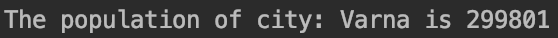
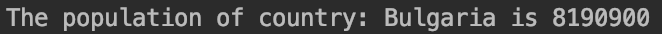
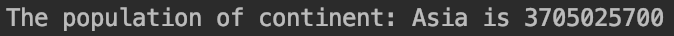
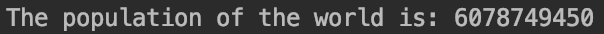
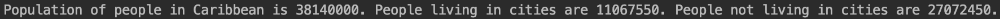
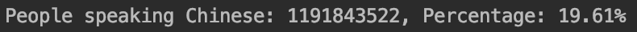

# Software Engineer Methods Project :clipboard:	
- Master Build Status : [](https://travis-ci.org/insertmike/sem)
- Develop Build Status : [](https://travis-ci.org/insertmike/sem)
- License : [](https://github.com/insertmike/sem/blob/master/LICENSE)
- Release : [](https://github.com/insertmike/sem/releases)

---

This report details information about the SEM Coursework Group Project for `Edinburgh Napier University`.

*Started Project:* 21/01/2020

*Project Members:* 
- Valeri Vladimirov
- Daniela Todorova
- Mihail Yonchev
- Miguel Bacharov

*Finished Project:* TBD

*Project Evaluation:* TBD

---

### Project Description:

This is a group project as part of the Software Engineering Methods module.
We are required to deliver a fully designed and implemented new system for an organisation to allow for
easy access to population information.

More Information on Coursework can be found [here](https://github.com/Kevin-Sim/set08103/tree/master/assessment).

---


### Reports

---

| ID  | Name          | Met           | Screenshot     |
  | ---|:-------------:| -------------:| --------------:|
  | 1  | Generate report with the population of a city |          Yes |            |
  | 2  | Generate report with the population of a district |          Yes |            |
  | 3  | Generate report with the population of a country|          Yes |            |
  | 4  | Generate report with the population of a region |          Yes |            |
  | 5  | Generate report with the population of a continent |          Yes |           |
  | 6  | Generate report with the population of the world |          Yes |            |
  | 7  | Generate report with the population of people, people living in cities, and people not living in cities in each country |          Yes |            |
  | 8  | Generate report with the population of people, people living in cities, and people not living in cities in each region |          Yes |            |
  | 9  | Generate report with the population of people, people living in cities, and people not living in cities in each continent |          Yes |            |
  | 10  | Generate report with the the number of people who speak English |          Yes |            |
  | 11  | Generate report with the the number of people who speak Hindi |          Yes |            |
  | 12 | Generate report with the the number of people who speak Spanish |          Yes |            |
  | 13  | Generate report with the the number of people who speak Chinese |          Yes |            |
  | 14  | Generate report with the the number of people who speak Arabic |          Yes |            |
  ---

### Connecting to the MySQL Container (Step-by-step) guide:

1. Pull/Fetch the latest master-branch version of the coursework.
2. Make sure docker is set up, connected and running in the background.
3. Run 'docker-compose.yml' file

To gain direct access to the docker container, and execute SQL Queries within,
do the following:
1. Open your terminal inside this project directory.
2. Run the following command: ```docker exec -it mysql bash -l```
3. Followed by: ```mysql -u root -p```
4. Enter your MySQL Container password
5. Check that you can view your database tables by running ```SHOW DATABASES;```
6. Done! :)
7. You can now execute normal MySQL Queries just as if you were running a local MySQL instance using Workbench
& Command Line Client.

---

### Running with Docker Compose:

When running the app, make sure that you have:

1. Packaged Maven Project Build Successfully,
2. All docker containers & images have been deleted,
3. Docker is up and running in your local machine,

Now run the app using ```docker-compose.yml``` file.

As an example, the app currently should do the following:

1. Set up 2 docker containers in parallel,
2. Execute the app container so that it detects, connects, queries & disconnects the
   docker-db container successfully.
3. You should see something like this:


---

### Project Progress:

Status | Report Type
------ | -------
☐  | Country
☐  | City
☐  | Capital City
☐  | Population
☐  | Other
